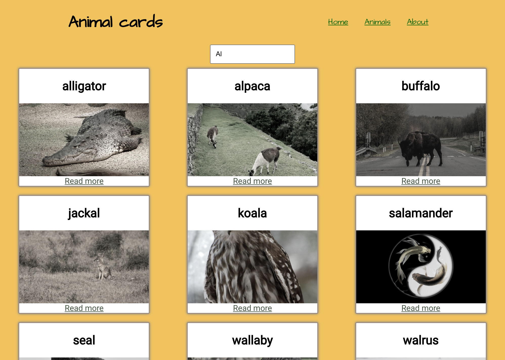

# Single page application (SPA)

An application to create cards from a list of animals. Images in cards are fetched from Unsplash. A link for the Wikipedia page for each animal is provided.

## Usage:
Search for an animal by typing in the input field. An animal list of animals that contains the given string is shown.
A picture of every animal is fetched from Unsplash. If no text is typed in the input, all the animals in the list are shown.Clicking the *read more* link brings to a separate animal card with a link to the Wikipedia page of the given animal.

## Concepts practised:
- routing and nested routing
- controlled forms

## Built with:
- REACT
- JXS
- CSS

## Screenshot:

### Credits: 

- animals pictures fron Unsplash: https://unsplash.com/developers